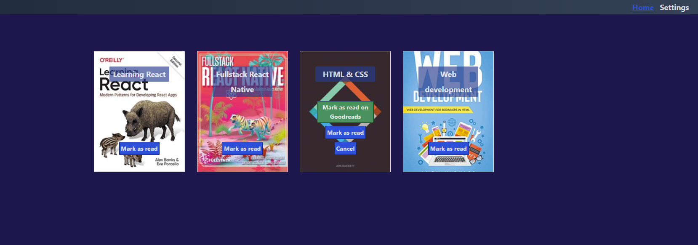
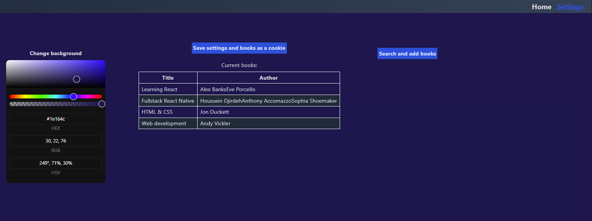
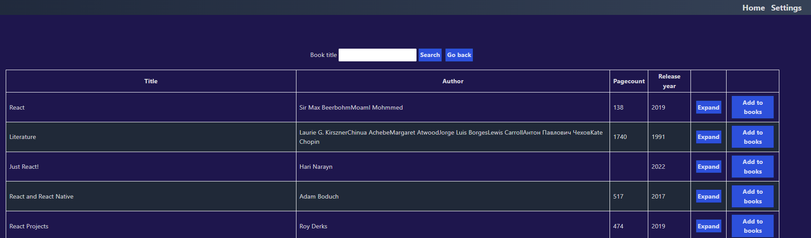
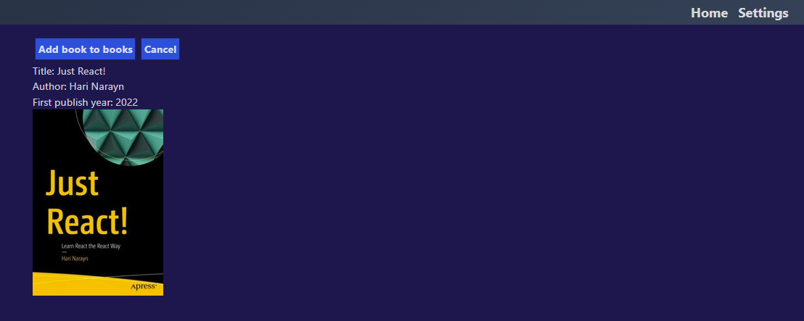

pieni sivusto, jota voisi käyttää 'homepagena', koska en ikinä muista merkata kirjaa luetuksi goodreadsissa. Mahdollista etsiä kirjoja käyttäen openlibrary.org API:a ja asettaa silmää miellyttävä taustaväri. Aktiiviset kirjat ja väri tallennetaan keksinä selaimeen painamalla 'Save settings' nappia.

'Home'

'Settings'

'Search and add books'

'Expand a specific book'

